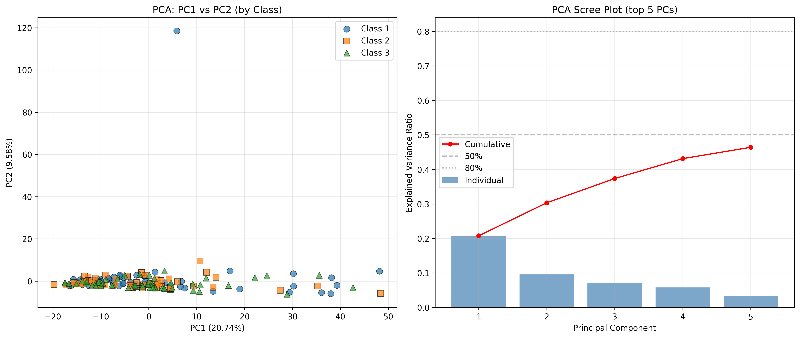

# 数据审计报告 (Data Audit Report)

**生成时间**: 2026-07-12 16:16:29
**数据文件**: `data/1、2、3.xlsx`

---

## 1. 数据结构

| 项目 | 值 |
|------|-----|
| Excel 文件 | `data/1、2、3.xlsx` |
| Sheet 名称 | Sheet6 |
| Excel 维度 | 161 rows × 1735 cols |
| 样本数 | 159 |
| 原始特征数 (含 Unknown) | 1734 |
| Unknown VOC 名称数 | 746 |
| 已知 VOC 特征数 | 988 |
| 类别 1 数量 | 53 |
| 类别 2 数量 | 53 |
| 类别 3 数量 | 53 |
| 缺失值 (NaN) | 0 |
| 正/负无穷 | 0 / 0 |
| 负值数量 | 0 |
| 常数特征 | 0 |
| 重复特征列 | 0 |
| 完全重复样本 | 0 |
| 近重复样本对 (r > 0.999) | 0 |
| 样本 ID 格式 | sample_row_NNNN (based on original Excel row) |

### Excel 实际结构

- **Row 0**: Header — `Class` 列 + VOC ID 编号 (0, 1, 2, ...)
- **Row 1**: VOC 名称 (部分为 `Unknown`)
- **Rows 2-160**: 数据行 (159 个样本)
- **Col 0**: 类别标签 (1, 2, 3)
- **Cols 1-1734**: VOC 特征值 (1734 个特征)

### 近重复样本检查

未发现 Pearson r > 0.999 的近重复样本对。

---

## 2. 元数据审计

### 检查过的位置

- Excel file: data/1、2、3.xlsx, sheet: Sheet6
- Row 0 (header): all columns
- Row 1 (VOC name row): all columns
- Column 0 (label column): header = "Class", row1 = NaN
- MAT file: data/voc_dataset_1+2_vs_3.mat — only X, y, feat_names
- Repository files: no separate metadata CSV/JSON found

### 结论

在当前检查的工作表 (Sheet6)、列名和仓库数据文件中未发现 subject_id、batch_id、instrument_id、collection_date、location、operator、replicate_id 等元数据。

### 影响

- ❌ 无法排除受试者泄漏 (同一受试者可能跨训练/测试集)
- ❌ 无法排除批次混杂 (标签可能与 batch 高度重合)
- ❌ 后续随机分层 CV 依赖"样本相互独立"这一**暂时假设**
- ⚠️ 缺少元数据**不能**被自动解释为任务错误，但必须降低证据等级

已创建元数据模板: `data/metadata_template.csv`

---

## 3. 标签任务审计

### 固定 Pipeline 配置

```
SimpleImputer(strategy="median")
→ StandardScaler()
→ LogisticRegression(penalty="l2", C=1.0, solver="liblinear", class_weight=None, max_iter=10000, random_state=42)
```

No hyperparameter search. All data-driven steps inside CV fold.

### 任务定义

| 任务 | 正类 (→1) | 负类 (→0) | 总样本 | 正类数 | 负类数 |
|------|-----------|-----------|--------|--------|--------|
| **1vs2** | Class 2 → 1 | Class 1 → 0 | 106 | 53 | 53 |
| **1vs3** | Class 3 → 1 | Class 1 → 0 | 106 | 53 | 53 |
| **2vs3** | Class 3 → 1 | Class 2 → 0 | 106 | 53 | 53 |
| **1+2vs3** | Class 3 → 1 | Class 1,2 → 0 | 159 | 53 | 106 |

### Logistic Regression — Pooled OOF 指标

| 任务 | F1 | Balanced Acc | MCC | ROC-AUC | PR-AUC | Precision | Sensitivity | Specificity |
|------|----|-------------|-----|---------|--------|-----------|-------------|------------|
| 1vs2 | 0.3960 | 0.4245 | -0.1516 | 0.4445 | 0.4812 | 0.4167 | 0.3774 | 0.4717 |
| 1vs3 | 0.8190 | 0.8208 | 0.6416 | 0.8225 | 0.7720 | 0.8269 | 0.8113 | 0.8302 |
| 2vs3 | 0.6019 | 0.6132 | 0.2268 | 0.6169 | 0.5923 | 0.6200 | 0.5849 | 0.6415 |
| 1+2vs3 | 0.5047 | 0.6274 | 0.2535 | 0.6682 | 0.4742 | 0.5000 | 0.5094 | 0.7453 |

### Logistic Regression — Fold-wise Mean ± Std

| 任务 | F1 | Balanced Acc | MCC | ROC-AUC | PR-AUC |
|------|----|-------------|-----|---------|--------|
| 1vs2 | 0.3941±0.0332 | 0.4227±0.0589 | -0.1551±0.1182 | 0.4389±0.0484 | 0.5300±0.0663 |
| 1vs3 | 0.8214±0.0805 | 0.8191±0.0840 | 0.6496±0.1670 | 0.8177±0.0971 | 0.8364±0.1268 |
| 2vs3 | 0.5987±0.0825 | 0.6127±0.0701 | 0.2309±0.1420 | 0.5997±0.1008 | 0.6433±0.0909 |
| 1+2vs3 | 0.5001±0.2335 | 0.6237±0.1700 | 0.2503±0.3445 | 0.6584±0.1756 | 0.5243±0.1444 |

### 混淆矩阵 (Pooled OOF)

| 任务 | TN | FP | FN | TP |
|------|----|----|----|----|
| 1vs2 | 25 | 28 | 33 | 20 |
| 1vs3 | 44 | 9 | 10 | 43 |
| 2vs3 | 34 | 19 | 22 | 31 |
| 1+2vs3 | 79 | 27 | 26 | 27 |

### 基线模型 — Pooled OOF 指标

| 任务 | 基线 | F1 | Balanced Acc | MCC | ROC-AUC | PR-AUC |
|------|------|----|-------------|-----|---------|--------|
| 1vs2 | DummyClassifier(most_frequent) | 0.4211 | 0.4811 | -0.0386 | 0.4811 | 0.4910 |
| 1vs2 | DummyClassifier(stratified) | 0.5047 | 0.5000 | 0.0000 | 0.5000 | 0.5000 |
| 1vs2 | AllPositive | 0.6667 | 0.5000 | 0.0000 | 0.5000 | 0.5000 |
| 1vs3 | DummyClassifier(most_frequent) | 0.4211 | 0.4811 | -0.0386 | 0.4811 | 0.4910 |
| 1vs3 | DummyClassifier(stratified) | 0.5047 | 0.5000 | 0.0000 | 0.5000 | 0.5000 |
| 1vs3 | AllPositive | 0.6667 | 0.5000 | 0.0000 | 0.5000 | 0.5000 |
| 2vs3 | DummyClassifier(most_frequent) | 0.4211 | 0.4811 | -0.0386 | 0.4811 | 0.4910 |
| 2vs3 | DummyClassifier(stratified) | 0.5047 | 0.5000 | 0.0000 | 0.5000 | 0.5000 |
| 2vs3 | AllPositive | 0.6667 | 0.5000 | 0.0000 | 0.5000 | 0.5000 |
| 1+2vs3 | DummyClassifier(most_frequent) | 0.0000 | 0.5000 | 0.0000 | 0.5000 | 0.3333 |
| 1+2vs3 | DummyClassifier(stratified) | 0.1136 | 0.4057 | -0.2147 | 0.4057 | 0.3154 |
| 1+2vs3 | AllPositive | 0.5000 | 0.5000 | 0.0000 | 0.5000 | 0.3333 |

**注意**: 以上结果仅用于描述标签异质性，**不得**根据哪个任务分数最高自动改变主任务。
主任务固定为 `1+2 vs 3`，任何调整必须由领域依据决定。

当前简单线性模型未发现类别 1 与类别 2 的明显区分信号；
该结果**不能**替代类别合并所需的领域依据。

---

## 4. PCA 可视化

| 指标 | 值 |
|------|-----|
| 使用特征数 (去 Unknown) | 988 |
| PC1 方差解释 | 0.2074 (20.74%) |
| PC2 方差解释 | 0.0958 (9.58%) |
| PC1+PC2 累积 | 0.3032 (30.32%) |



**注意**: PCA 可视化仅用于探索性描述，**禁止**将其解释为强证据或用于判断模型有效性。

---

## 5. 预处理流程回顾

当前预处理流程 (见 `preprocessing_data.ipynb`):

1. 去除 Unknown 特征: 1734 → 988
2. 丰度筛选 (均值 > P40): 988 → 593
3. log1p 变换 + IQR 筛选 (IQR ≥ P25): 593 → 445
4. 标签映射: 1,2 → 0; 3 → 1
5. 保存为 MAT 文件: `data/voc_dataset_1+2_vs_3.mat`

**当前全数据预处理** (在划分前进行) 使用了所有样本的信息来做特征筛选，
这在严格意义上引入了信息泄漏，但当前项目以此为基线。

---

## 6. 预存 MAT 文件验证

- MAT 文件: `/home/liuxy/projects/BPD_jj/data/voc_dataset_1+2_vs_3.mat`
- X shape: (159, 445)
- y shape: (159, 1)
- 特征数: 445
- 正类数 (label=1): 53
- 负类数 (label=0): 106

---

*报告由 `run_data_audit.py` 自动生成。*
